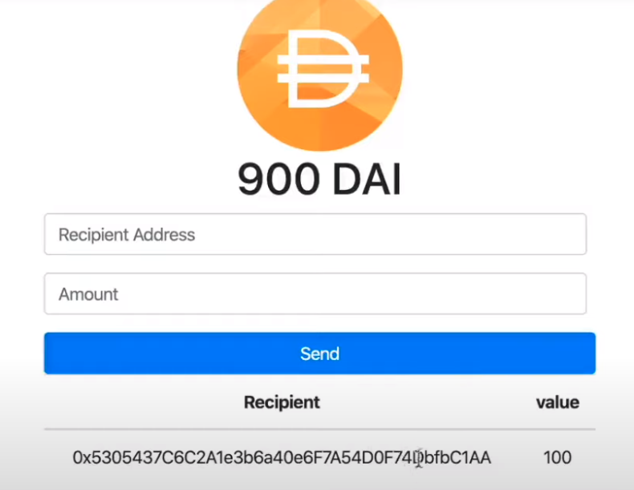

# Ehthereum Blockchian Wallet

## Deployed Link: https://blockchain-wallet.netlify.app/

## Technology Used

- React
- Nodejs
- Truffle
- Ganashe
- Openzepplin
- Web3

## Installation

- Fork/Clone or download zip
- start ganashe
- In migrations folder add address from ganashe and # of coins to mint
- truffle compile
- truffle migrate
- Replace dai token address in app.js from abis
